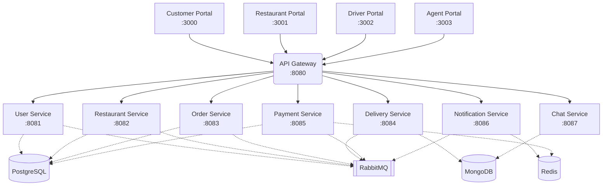

# Zomato Clone

A production-grade, highly scalable microservices architecture clone of Zomato. This project demonstrates a distributed system handling customer orders, restaurant management, delivery tracking, real-time chat, and payments—served across four distinct frontend portals.

## 🏗️ Architecture Diagram



## 📦 System Components

### Frontend Applications (Next.js & React)
- **Customer Portal (`:3000`)**: End-user application to browse menus, manage carts, track deliveries, and communicate with AI support agents.
- **Restaurant Portal (`:3001`)**: Dashboard for restaurant owners to create establishments, build digital menus, track orders, and view revenues.
- **Driver Portal (`:3002`)**: Interface for delivery drivers to receive mapped assignments and update realtime drop-off statuses.
- **Agent/Admin Portal (`:3003`)**: High-level incident management view to oversee support tickets, escalate AI interactions, and monitor system health.

### Backend Microservices
| Service | Stack | Port | Primary Responsibilities | Database |
|---------|-------|------|-------------------------|----------|
| **API Gateway** | Express / TS | `8080` | Traffic routing, rate limiting, and core auth verification | Redis |
| **User Service** | Spring Boot | `8081` | Authentication, RBAC, User profile lifecycle | PostgreSQL |
| **Restaurant Service** | Spring Boot | `8082` | Menu management, Store CRUD, Customer Reviews | PostgreSQL |
| **Order Service** | Spring Boot | `8083` | Shopping carts, Order states, Processing execution | PostgreSQL |
| **Delivery Service** | Express / Node | `8084` | Geolocation processing, Driver assignment matching | MongoDB |
| **Payment Service** | Express / Node | `8085` | Payment processing execution, Coupons validation | PostgreSQL & Redis |
| **Notification Service** | Express / Node | `8086` | Realtime execution of WebSockets & Emails via AMQP | Redis |
| **Chat Service** | Express (Socket.IO) | `8087` | Intelligent AI Chat support, Ticket escalations | MongoDB |

### Infrastructure
- **PostgreSQL**: Primary transactional source of truth for auth, orders, menus, and payments.
- **MongoDB**: Used for highly flexible nested documents tracking delivery telemetry and chat transcripts.
- **Redis**: In-memory data structuring acting as rapid session caches and rate limiters.
- **RabbitMQ**: The message broker empowering asynchronous microservice chatter (Event-Driven mapping).

---

## 🚀 Getting Started

### Prerequisites
- [Docker](https://docs.docker.com/get-docker/) & Docker Compose
- Node.js `v18+` (Only required if developing bare-metal)
- Java 17 (Only required if running Spring backend tasks manually)

### Run Locally via Docker (Recommended)
This architecture is entirely container-driven and pre-configured to spin up locally effortlessly.

1. **Clone the repository**
   ```bash
   git clone https://github.com/UMESHA123/zomato-clone.git
   cd zomato-clone
   ```

2. **Boot the Network**
   ```bash
   docker-compose up -d
   ```
   *This command will pull the necessary images, build all internal microservices and frontend clients, then attach them onto an isolated Docker network. (Note: The first run might take 5-10 minutes to compile everything)*

3. **Verify the Stack**
   - Head to `http://localhost:3004` to access the native Health Check UI to ensure all Core Services & Dependency Databases display a healthy pulse.
   
4. **Access the Applications**
   - Customer Portal: `http://localhost:3000`
   - Restaurant Portal: `http://localhost:3001`
   - Driver Portal: `http://localhost:3002`
   - Support Agent Portal: `http://localhost:3003`

---

## 🛠️ Continuous Integration & Delivery (Jenkins)

This repository holds a bespoke, production-ready Jenkins continuous deployment lifecycle definition (`Jenkinsfile`). 

If you are a developer looking to deploy updates reliably across this network:
- Check out `README-CICD.md` located inside the root project directory for specific guidelines.
- The pipeline automates the checkout > parallel lint validations > image packaging > registry deployments efficiently inside isolated container layers.

---
*Built intricately with ❤️ by UMESHA*